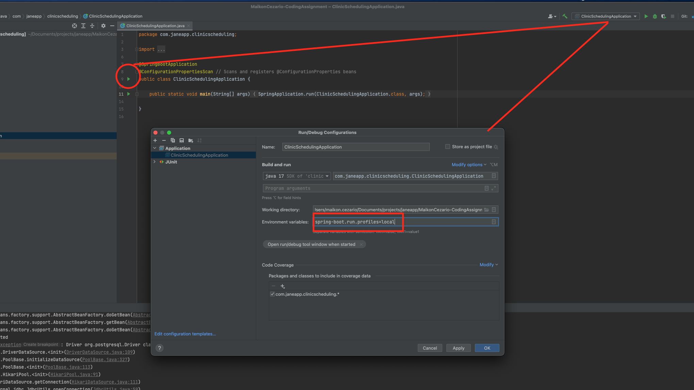

# Clinic Scheduling Application

This repository contains the following functionality for a dummy scheduling application:
* Create initial application's set up
  * Provide local infrastructure for local database with Docker
    * Initial database load for practitioners and patients is provided. Update `infrastructure/local/db_dump/inital_load.sql` if more records are necessary
  * Database changes are being handled by Flyway. Create files under `src/main/resources/db/migration` for modifications
    * Run `make flyway-migrate` or `./mvnw clean spring-boot:run -Dspring-boot.run.profiles=local -Dspring-boot.run.arguments="--spring.main.banner-mode=off --spring.main.web-application-type=none";` to execute Flyway migration
  * Configure Spring Boot `local` profile in order to enable local development to point to the local database
* Create database schema
  * `patient`: stores patients information
  * `practitioner`: stores practitioner information
  * `practitioner_unavailability`: stores unavailability time for a given practitioner
  * `appointment`: stores the appointment between patients and practitioners for a given appointment type and time
* Create endpoints
  * `[POST] /appointments` - Enables appointment's creation
    > The time's value should be informed by the request caller. Validations will happen using the clinic's timezone and it will be stored in UTC in the database
  * `[GET] /appointments?type={appointmentType:INITIAL|CHECK_IN|STANDARD}&date={date}` - Returns suggested available time spots for a given appointment type and date
    > The time spots date range will be returned in the timezone provided in the request. If none is passed, `UTC` is used by default
  * `[GET] /practitioners/{id}/appointments` - Returns all appointments of current day for a given practitioner
    > The time spots date range will be returned in the timezone provided in the request. If none is passed, `UTC` is used by default
* Create tests
  * unit tests:
    * Test each layer of the application mocking its integration when needed
  * integration tests:
    * Repositories are testing database operations with a real Postgres database - a docker container is provisioned during tests so that operations can be reliably performed/checked. This provides fast error feedback during the development phase to check SQL statement compatibilities with PG. This is also good for scenarios where the database version needs to be bumped and sanity checked. These tests bring the safety net required for tests run either locally or in the CI/CD pipeline
    * An e2e testing the happy path of the endpoints being introduced in this PR
    * These tests specify the `test` profile so that specific configurations can be applied for the tests

### Local Setup

You can run the application locally via command line or inside your IDE. In order to run the application and tests, the machine needs to have docker installed (Please refer to the [docker documentation](https://docs.docker.com/engine/install/) for installation details).   

See examples below showing how to start the application:

**Command line:**

- Run the `make start-app` command to start both database and application
  > If you wish, you can run database separately. To start only the database, run `make start-database` or `docker compose -f infrastructure/local/docker-compose.yaml up -d` or `docker start db` (if the database was already previously set up)

**IDE (Example with Intellij):**

- Make sure your docker database container is up and running
  - Run either `make start-database` or `docker compose -f infrastructure/local/docker-compose.yaml up -d` to start the database docker container   
- Configure the `local` profile so that the application can reach your local PostgreSQL database:
  

### How to run tests

Tests can be executed via either one of the following commands: `./mvnw clean test` or `make run-tests`

### Running the application
* Start the application: Run `make start-app`
  * Create an appointment by calling the `[POST] /appointments` endpoint
    * Request sample:
        ```curl
        curl -X POST \
          http://localhost:8080/appointments \
          -H 'Content-Type: application/json' \
          -H 'Time-Zone: America/Vancouver' \
          -H 'cache-control: no-cache' \
          -d '{
        	"type": "INITIAL",
        	"patientId": 1,
        	"practitionerId": 1,
        	"time": "2025-02-24T09:00:00Z"
        }'
        ```
    * Response sample:
        ```json
        {
                "id": 1
        }
        ```   
  * Create an appointment by calling the `[GET] /appointments` endpoint
    * Request sample:
      ```curl
        curl -X GET \
          'http://localhost:8080/appointments?type=STANDARD&date=2025-02-24' \
          -H 'Time-Zone: America/Vancouver'
      ```
    * Response sample:
      ```json
      [
          {
              "practitioner": {
                  "id": 1,
                  "name": "Sherise Borer",
                  "email": "sherise.borer@gmail.com",
                  "phone": "158-497-8789"
              },
              "availableSlots": [
                  {
                      "start": "2025-02-24 10:00",
                      "end": "2025-02-24 11:00"
                  }
              ]
          }
      ]
      ```
  * Create an appointment by calling the [GET] /practitioners/{id}/appointments` endpoint
    * Request sample:
      ```curl
        curl -X GET \
          'http://localhost:8080/practitioners/1/appointments' \
          -H 'Time-Zone: America/Vancouver'
      ```
    * Response sample:
      ```json
      [
          {
              "patient": {
                  "name": "Margart Pfeffer",
                  "email": "margart.pfeffer@gmail.com",
                  "phone": "1-705-401-6265"
              },
              "appointmentType": "STANDARD",
              "time": {
                  "start": "2025-02-24 09:00",
                  "end": "2025-02-24 10:00"
              }
          }
      ]
      ```
